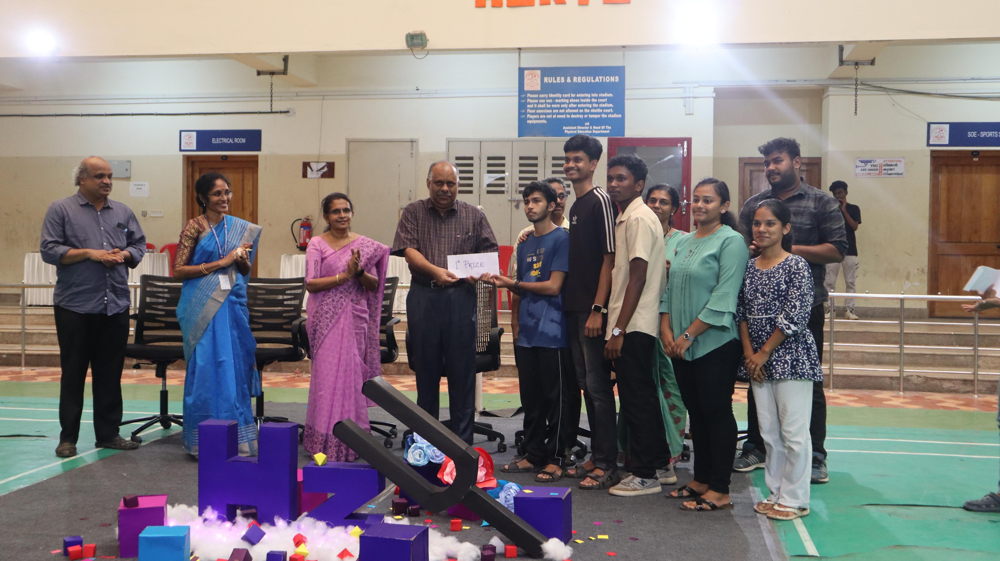
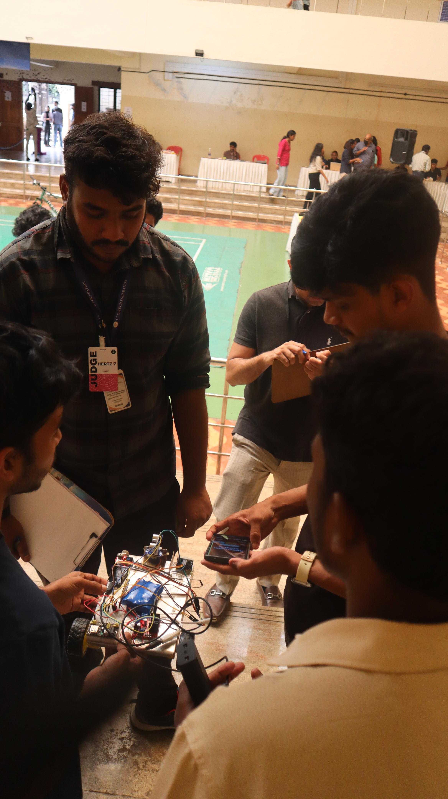

# 🏆 RescueBot - Team Zenith

**"Reaching New Heights in Innovation and Rescue Robotics"**

[](https://github.com/yourname/rescuebot)
[](https://github.com/yourname/rescuebot)
[](https://github.com/yourname/rescuebot)

## 🎉 Achievement
**🥇 First Prize Winner** at the **Hertz Microprocessor Hackathon** conducted by **ECSA**!

### 🏆 Prize Distribution Ceremony

https://github.com/user-attachments/assets/47bc2c58-ee33-41cb-96be-4d3f8d1d67cf


<br><em>Team Zenith with the first prize at ECSA Hertz Hackathon</em>

## 📸 Project Showcase

<div align="center">
  <br>
  <em>RescueBot behind the scenes</em>
</div>

<div align="center" style="margin-top: 32px;">
  <br>
  <em>RescueBot judgement</em>
</div>

## 🔍 Overview

RescueBot is a Wi-Fi-controlled robotic system designed to assist in hazardous environments where human presence is risky or impractical. Built specifically for search and rescue operations, it features remote operation capabilities, autonomous obstacle avoidance, gas detection, and emergency alert systems.

## 🚀 Key Features

- **🌐 Wi-Fi Remote Control** - Sleek web interface with neon-style dashboard
- **🤖 Multiple Control Modes** - WiFi Manual, Autonomous, and Idle modes
- **🚧 Intelligent Navigation** - Servo-controlled scanning with obstacle avoidance
- **💨 Gas/Alcohol Detection** - MQ2 sensor with real-time monitoring and alerts
- **🔄 Autonomous Operation** - Smart pathfinding with dynamic obstacle scanning
- **🆘 Emergency Alert System** - SOS, Gas, and Motion alert buttons
- **📊 Live Sensor Data** - Real-time distance and gas level readings
- **⚡ Cost-Effective** - Total project cost under ₹2000

## 🛠️ Hardware Components

| Component | Model/Pin | Purpose |
|-----------|-----------|---------|
| **Microcontroller** | ESP32 DevKit | Main controller with built-in Wi-Fi |
| **Motor Driver** | L298N | Controls DC motors with bidirectional movement |
| **Gas/Alcohol Sensor** | MQ2 (Pin 34) | Detects alcohol and hazardous gases |
| **Distance Sensor** | HC-SR04 (Pins 2,4) | Obstacle detection and avoidance |
| **Servo Motor** | SG90 (Pin 13) | 180° scanning for navigation |
| **Motors** | DC Geared | Robot locomotion with directional control |
| **Power Supply** | Lion/External | 5V power for entire system |

## 📋 Technical Specifications

### ESP32 Microcontroller
- **Dual-core processor** for efficient multitasking
- **Built-in Wi-Fi** - Direct connection without external modules
- **GPIO Pin Configuration**: Motors (5,18,19,21), Sensors (2,4,34), Servo (13)
- **Web Server Integration** using ESP32WebServer library

### Motor Control System
- **L298N H-Bridge** driver for bidirectional control
- **4-Motor Pin Configuration** for precise movement control
- **Independent motor control** for turning and maneuvering
- **Digital pin control** for forward, backward, left, right movements

### Sensor Integration
- **MQ2 Gas/Alcohol Sensor**: Analog reading on pin 34 with threshold detection
- **HC-SR04 Ultrasonic**: Trigger (pin 2) and Echo (pin 4) for distance measurement
- **Servo-Controlled Scanning**: 180° rotation for obstacle detection and pathfinding
- **Real-time Monitoring**: 100ms obstacle check, 1000ms gas level monitoring

### Autonomous Navigation System
- **State-Based Navigation**: Moving Forward → Scanning → Turning → Repeat
- **Intelligent Pathfinding**: Left/right scanning to find optimal routes
- **Obstacle Avoidance**: 20cm threshold distance with automatic stopping
- **Recovery Mechanisms**: Timeout handling and error detection

## 🌐 Web Control System

- **Futuristic Interface Design** - Orbitron font with animated neon-glow effects
- **Dynamic Background** - Gradient animations with space-theme colors
- **ESP32WebServer** - Lightweight HTTP server hosted directly on ESP32
- **Multiple Control Modes**: WiFi Manual, Autonomous Navigation, Idle Mode
- **Real-time Updates** - Live sensor data refresh every 1000ms
- **Emergency Alert System** - SOS, Gas Alert, and Motion Alert buttons
- **Mobile-Responsive** - Works seamlessly on phones, tablets, and computers
- **RESTful API** - Clean endpoints for movement, sensors, and alerts

## ⚠️ Current Limitations & Future Improvements

### Wi-Fi Limitations
- **Range**: 30-50m indoors, varies with WiFi router quality
- **Network Dependency**: Requires existing WiFi network (SSID: configured in code)
- **Single Client**: Optimized for one operator at a time

### Current Implementation Features
- **Smart Navigation**: Servo-based 180° scanning for optimal pathfinding
- **State Management**: Robust autonomous mode with obstacle recovery
- **Gas Detection**: Real-time alcohol/gas monitoring with threshold alerts
- **Error Handling**: Timeout mechanisms and invalid reading protection

## 🎯 Applications

- **🏘️ Disaster Response**: Navigate through debris with intelligent obstacle avoidance
- **🏭 Industrial Safety**: Alcohol/gas leak detection in hazardous environments
- **🔍 Search & Surveillance**: Remote scouting with autonomous navigation capabilities
- **📚 Education & Research**: IoT and robotics learning with advanced web interface
- **🚨 Emergency Operations**: Quick deployment with multiple alert systems
- **🏠 Home Security**: Autonomous patrol mode with real-time monitoring


## 🏗️ How It Works

1. **System Initialization**: ESP32 connects to WiFi network and starts web server
2. **Web Interface Access**: Users connect via browser to ESP32's IP address
3. **Mode Selection**: Choose between WiFi Manual, Autonomous, or Idle modes
4. **Manual Control**: Direct robot movement using intuitive web buttons
5. **Autonomous Navigation**: Robot scans environment, detects obstacles, and navigates intelligently
6. **Real-time Monitoring**: Continuous sensor data updates (gas levels, distance readings)
7. **Emergency Response**: Instant alerts via SOS, Gas Alert, and Motion Alert buttons
8. **Smart Recovery**: Automatic error handling and obstacle avoidance algorithms

### 🤖 Autonomous Mode Operation:
- **Scanning Phase**: Servo rotates to scan left/right for obstacles
- **Decision Making**: Analyzes distances and chooses optimal path
- **Navigation**: Moves forward, turns, or stops based on sensor data
- **Continuous Monitoring**: Maintains gas detection and safety protocols

## ⚙️ Hardware Configuration

### 📌 ESP32 Pin Mapping
```
Motor Control:
- Motor 1: Pin 5 (IN1), Pin 18 (IN2)
- Motor 2: Pin 19 (IN3), Pin 21 (IN4)

Sensors:
- HC-SR04 Ultrasonic: Pin 2 (Trigger), Pin 4 (Echo)
- MQ2 Gas Sensor: Pin 34 (Analog Input)
- SG90 Servo: Pin 13 (PWM Control)

Power: 5V supply for motors, 3.3V for sensors
```

### 🔌 Connection Setup
1. **WiFi Network**: Configure SSID and password in code
2. **Serial Monitor**: 115200 baud rate for debugging
3. **Web Access**: Connect to ESP32's IP address via browser
4. **Sensor Calibration**: Gas threshold set to 1000 (adjustable)

## 🏆 Team Zenith

**Event**: Hertz Microprocessor Hackathon  
**Organizer**: ECSA (Electronics and Communication Students Association)  
**Result**: 🥇 **First Prize**  
**Category**: Microprocessor-based Innovation

## 👥 Team Members

- Deeraj P Menon (me)
- Hithek Siva
- N Navaneeth
- Juliya George
- Gopika E

---

*"Innovation in robotics isn't just about technology—it's about saving lives and making the world safer for everyone."*
